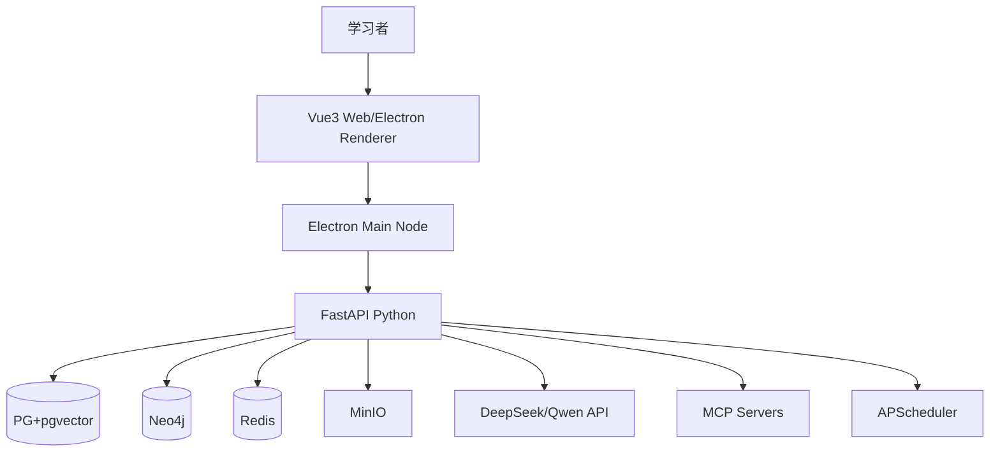
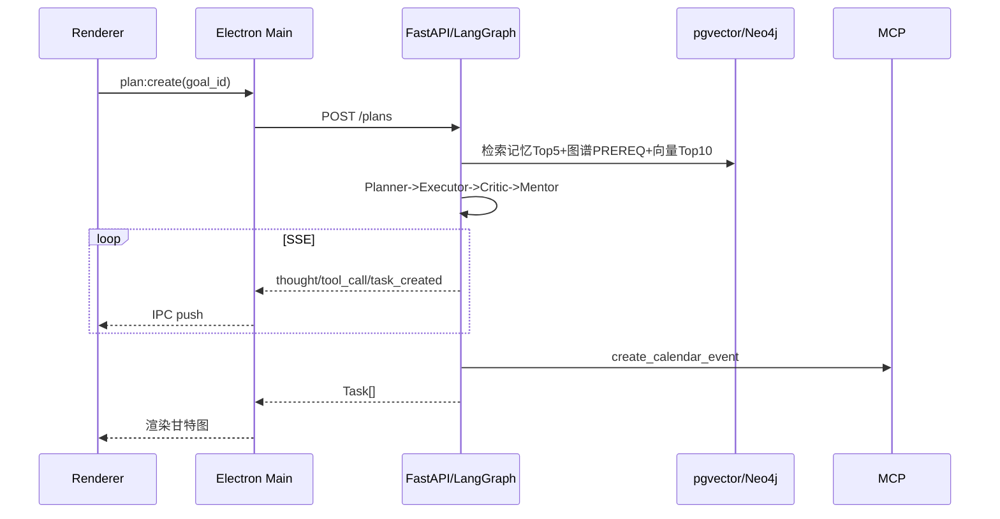

# 系统架构设计

> 版本：v0.3_20260822 | 02-需求与设计 | 详细版

## 修订历史

| 日期 | 版本 | 变更 |
|------|------|------|
| 2026-08-22 | v0.3 | 按C4+部署+安全+性能全量细化 |
| 2026-08-22 | v0.2 | 补充时序 |
| 2026-08-22 | v0.1 | 初版 |

## 1. 架构目标与约束

- 单人28周，6创新可演示，论文可写
- 三端复用同一后端，桌面轻量（<15M不含模型）
- 离线可查历史，在线才调LLM/MCP

## 2. 总体架构（C4 L1）



## 3. 逻辑分层（C4 L2）

| 层 | 组件 | 职责 | 技术 |
|----|------|------|------|
| 表现层 | Web/Electron Renderer/CLI | 甘特/日历/大屏/上传/Trace | Vue3+Naive UI+Tailwind, FullCalendar, ECharts, Typer+Rich |
| 桌面壳 | Electron Main | 窗口/IPC/代理/UI状态 | Electron 40, better-sqlite3, node-pty(预留) |
| 网关 | FastAPI | 鉴权/校验/限流/SSE | FastAPI, Pydantic, SQLModel, JWT |
| 编排 | LangGraph | 多Agent协作 | StateGraph, ReAct |
| 能力 | Memory/RAG/Graph/MCP/Reflector | 记忆/检索/图谱/工具/反思 | pgvector, Neo4j, MCP SDK, APScheduler |
| 存储 | PG/Neo4j/Redis/MinIO | 业务/向量/图/缓存/文件 | PG16, Neo4j5, Redis7, MinIO |
| 模型 | LLM/VL/ASR | 生成/OCR/ASR | DeepSeek-V3, Qwen-VL, Whisper |

## 4. 详细交互

### 4.1 进程模型

- Renderer: 纯UI，0业务，经`window.electronBridge.invoke`调Main
- Main: Node，注册IPC表`plan:create, memory:search...`，每handler拿`origin`区分窗口；对`*.api`请求走Fetch代理自动注入`Authorization`
- FastAPI: 业务与智能，`trace_id`贯穿agent_run_log

### 4.2 核心时序（规划）



### 4.3 SSE

`GET /plans/stream?trace_id`，`astream_events`，断线重连带`Last-Event-ID`，首字节<2s

## 5. 部署架构

### 5.1 开发

```
pnpm dev (5173) + electron:dev (Main) + uvicorn 8000 + docker-compose (pg:5432, neo4j:7687, redis:6379, minio:9000)
```

### 5.2 生产

- **Web**: `frontend dist` + FastAPI Docker上云
- **桌面**: `electron-builder externalBin:[server]`，sidecar随App启动，离线查历史，在线切云端地址

## 6. 非功能设计

| 类别 | 设计 |
|------|------|
| 性能 | pgvector HNSW(m=16,ef=64), Redis缓存plan 1h, SSE流式, 图<1万节点 |
| 安全 | contextIsolation/sandbox, Pydantic严格, Keyring存Key, JWT 7d, 限流10/min |
| 可靠 | LLM超时15s重试1, MCP失败降级, APScheduler错过补跑, 双库隔离 |
| 可扩展 | MCP可插拔(mcp.json), Agent节点可增, 策略热更新 |
| 可观测 | Langfuse追踪, agent_run_log全量, /health |

## 7. 技术选型论证

- Electron 40 vs Tauri: 选Electron，0 Rust成本，对标Codex，Node生态直接用better-sqlite3/node-pty
- PG+pgvector vs 独立向量库: 一库两用，运维少，毕设量级足够
- LangGraph vs CrewAI: LangGraph可控StateGraph，适合论文画图

## 8. 目录映射

```
app/frontend/src/{views,stores,api,components}
app/desktop/electron/{main,preload,ipc}
app/server/{api,agents,memory,rag,graph,mcp,scheduler}
```

## 变更日志

| 日期 | 版本 | 变更 |
|------|------|------|
| 2026-08-22 | v0.3 | C4+时序+部署+非功能全量 |
