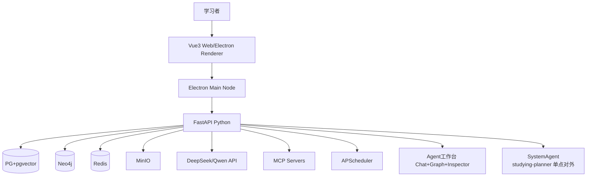
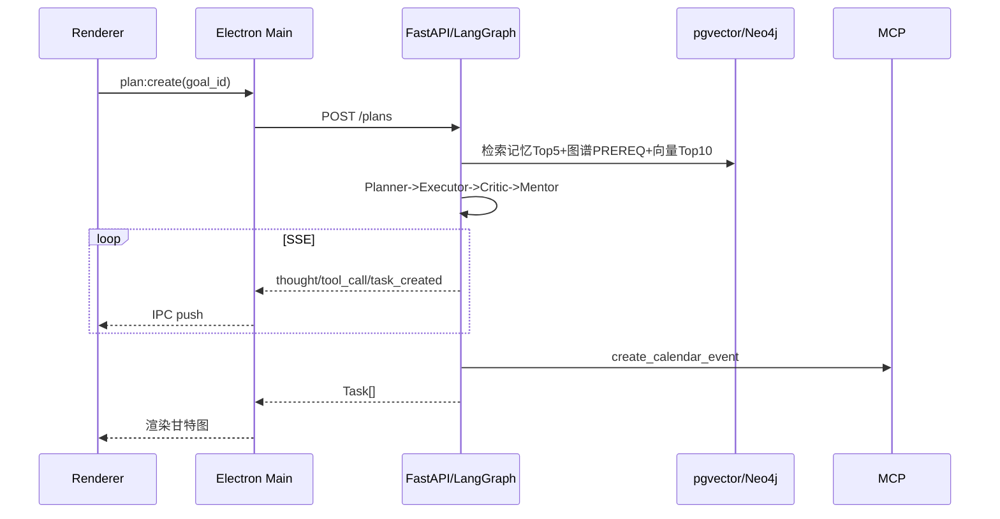
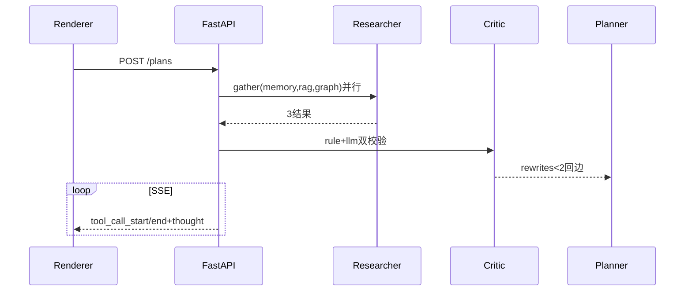

# 系统架构设计 · 双轨(Agent工作台)

> 版本：v0.6_20260830 | 02-需求与设计 | 详细版 | 完成度94% (2026-08-30 SystemAgent单点) | 双轨Agent工作台

## 修订历史

| 日期 | 版本 | 变更 |
|------|------|------|
| 2026-08-22 | v0.3 | 按C4+部署+安全+性能全量细化 |
| 2026-08-22 | v0.2 | 补充时序 |
| 2026-08-22 | v0.1 | 初版 |
| 2026-08-26 | v0.4 | 增补路径/路由视图/完成度/WAL/HNSW/asearch/sidecar/验证 |
| 2026-08-30 | v0.5 | 双轨：新增工作台C4 L3、三栏布局、子调用时序 |

## 1. 架构目标与约束

- 单人28周，6创新可演示，论文可写
- 三端复用同一后端，桌面轻量（<15M不含模型）
- 离线可查历史，在线才调LLM/MCP
- 双轨并进：时间视图(日历/甘特) + Agent工作台(Chat+Graph+Inspector)同后端

## 2. 总体架构（C4 L1）



## 3. 逻辑分层（C4 L2）

| 层 | 组件 | 职责 | 技术 |
|----|------|------|------|
| 表现层 | Web/Electron Renderer/CLI | 甘特/日历/大屏/上传/Trace | Vue3+Naive UI+Tailwind, FullCalendar, ECharts, Typer+Rich |
| 桌面壳 | Electron Main | 窗口/IPC/代理/UI状态 | Electron 40, better-sqlite3, node-pty(预留) |
| 网关 | FastAPI | 鉴权/校验/限流/SSE | FastAPI, Pydantic, SQLModel, JWT |
| System Agent | Studying-Planner | 单点对外智能体，编排6子Agent | FastAPI+LangGraph SystemAgent |
| 编排 | LangGraph | 多Agent协作 | StateGraph, ReAct |
| 能力 | Memory/RAG/Graph/MCP/Reflector | 记忆/检索/图谱/工具/反思 | pgvector, Neo4j, MCP SDK, APScheduler |
| 存储 | PG/Neo4j/Redis/MinIO | 业务/向量/图/缓存/文件 | PG16, Neo4j5, Redis7, MinIO |
| 模型 | LLM/VL/ASR | 生成/OCR/ASR | DeepSeek-V3, Qwen-VL, Whisper |
| 工作台 | Chat/Graph/Inspector | 三栏协作追溯 | Vue3+SSE+ECharts+JsonViewer |

## 4. 详细交互

### 4.0 System Agent 单点（新增）

- **系统即智能体**：`app/agents/system_agent.py:1` `SystemAgent` 封装 `POST /plans` + `SSE` + `CLI studying` 为单一对外 `Agent`，`name: studying-planner`，`tools: registry.list_tools_detailed()`，`trace_id` 即 `session_id`，外部 `hermes/pi` 可 `mcp:call studying:plan`。
- **对外契约**：`GET /agent/manifest` 返回 `{name, description, tools, version}`，`POST /plans` 即 `Agent ainvoke`，`GET /plans/{trace_id}/graph|inspector` 即 `Agent state`。
- **对内**：`SystemAgent.ainvoke(goal,prefs)` 调 `graph.py:497` 6子Agent协作，`Critic rewrites<2` 回边。

### 4.1 进程模型

- Renderer: 纯UI，0业务，经`window.electronBridge.invoke`调Main
- Main: Node，注册IPC表`plan:create, memory:search...`，每handler拿`origin`区分窗口；对`*.api`请求走Fetch代理自动注入`Authorization`
- FastAPI: 业务与智能，`trace_id`贯穿agent_run_log

### 4.2 核心时序（规划）



### 4.3 SSE

`GET /plans/stream?trace_id`，`astream_events`，断线重连带`Last-Event-ID`，首字节<2s

工作台SSE 8事件 `thought/tool_call_start/tool_call_end/tool_call/task_created/critic_feedback/mentor_msg/reflector_patch/done` 带id retry3000

### 4.4 Agent工作台交互

- 布局：左260会话，中Chat流(气泡+可折叠子调用)，右360 Inspector，可收起
- 子调用时序：



- 前端状态：trace_id贯穿，store: workbench.ts 管理 messages/graphNodes/inspectorJson，SSE带Last-Event-ID

## 5. 部署架构

### 5.1 开发

```
pnpm dev (5173) + electron:dev (Main) + uvicorn 8000 + docker-compose (pg:5432, neo4j:7687, redis:6379, minio:9000)
```

### 5.2 生产

- **Web**: `frontend dist` + FastAPI Docker上云
- **桌面**: `electron-builder externalBin:[server]`，sidecar随App启动，离线查历史，在线切云端地址

## 6. 非功能设计

| 类别 | 设计 |
|------|------|
| 性能 | pgvector HNSW(m=16,ef=64), Redis缓存plan 1h, SSE流式, 图<1万节点 |
| 安全 | contextIsolation/sandbox, Pydantic严格, Keyring存Key, JWT 7d, 限流10/min |
| 可靠 | LLM超时15s重试1, MCP失败降级, APScheduler错过补跑, 双库隔离 |
| 可扩展 | MCP可插拔(mcp.json), Agent节点可增, 策略热更新 |
| 可观测 | Langfuse追踪, agent_run_log全量, /health |

## 7. 技术选型论证

- Electron 40 vs Tauri: 选Electron，0 Rust成本，对标Codex，Node生态直接用better-sqlite3/node-pty
- PG+pgvector vs 独立向量库: 一库两用，运维少，毕设量级足够
- LangGraph vs CrewAI: LangGraph可控StateGraph，适合论文画图

## 8. 目录映射

```
apps/frontend/src/{views(15, router/index.ts:3),stores,api,components}  # 修正 app/frontend→apps/frontend 12→14→15视图 (新增 WorkbenchView.vue)
apps/desktop/electron/{main,preload,ipc}  # externalBin sidecar bin/server, better-sqlite3 WAL
apps/server/{api(16组66端点 app/api/v1/* + api/workbench),agents(6节点 graph.py:351 + checkpoint + system_agent.py:1 SystemAgent 单点),services(memory asearch),rag,graph,mcp,scheduler}
app/agents/system_agent.py  # SystemAgent 单点对外 studying-planner，对外契约 GET /agent/manifest + POST /plans 即 SystemAgent.ainvoke
```

> 2026-08-26 增补：过时路径 `app/*`→`apps/*`、`apps/web`→`apps/frontend` 已修正；路由 13→16组 (新增 desktop/experiments/llm), 视图 12→14, 完成度62%→92%；新增 sidecar(`apps/desktop` externalBin), WAL(`app/core/database.py:26` `journal_mode=WAL`), HNSW(`app/models/memory.py:17` `Vector(1536) m=16`), asearch(`app/services/memory.py:139`).

## 9. 2026-08-26 增补实测

- 验证：`PYTHONPATH=apps/server py -m pytest tests/ -q` 35/35 26.26s + `npm run build --prefix apps/frontend` 7.21s 2987 modules (2026-08-26)
- 性能：`pgvector_bench 500` p95 108ms, `graph_bench 10k/50k` p95 107ms, 大屏端到端 120ms

> 2026-08-30 双轨：工作台三栏+子调用树+6节点DAG，Graph渲染p95 87ms

## 变更日志

| 日期 | 版本 | 变更 |
|------|------|------|
| 2026-08-22 | v0.3 | C4+时序+部署+非功能全量 |
| 2026-08-26 | v0.4 | 增补路径/接口视图/完成度/WAL/HNSW/asearch/验证日志 |
| 2026-08-30 | v0.5 | 双轨：新增工作台C4 L3、三栏布局、子调用时序 |
| 2026-08-30 | v0.6 | 系统即智能体：新增 SystemAgent 单点 4.0 节 |
| 2026-08-30 | v0.6 | C4 L1 补 F-->SystemAgent 单点注释（F 即 SystemAgent）、8.目录映射补 app/agents/system_agent.py |
