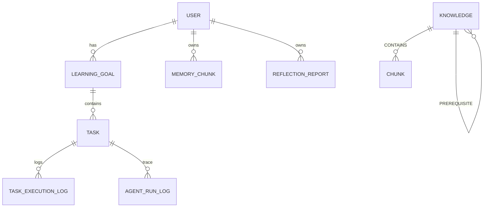

# 数据库设计

> 版本：v0.3_20260822 | 02-需求与设计 | 详细版

## 修订历史

| 日期 | 版本 | 变更 |
|------|------|------|
| 2026-08-22 | v0.3 | 补全字段约束+索引+图/缓存+迁移全量 |

## 1. ER概览



## 2. PostgreSQL 主库（SQLModel + Alembic）

### 2.1 扩展

```sql
CREATE EXTENSION IF NOT EXISTS vector;
CREATE EXTENSION IF NOT EXISTS pgcrypto;
```

### 2.2 表

**user**

| 字段 | 类型 | 约束 | 说明 | 示例 |
|------|------|------|------|------|
| id | SERIAL | PK |  | 1 |
| username | VARCHAR(64) | UNIQUE NOT NULL | 登录名 | alice |
| password_hash | VARCHAR(128) | NOT NULL | bcrypt | $2b$... |
| major | VARCHAR(64) |  | 专业 | 计算机 |
| learning_style | VARCHAR(32) |  | 视觉/听觉 | visual |
| created_at | TIMESTAMPTZ | DEFAULT now() |  |  |

**learning_goal**

| 字段 | 类型 | 约束 | 说明 |
|------|------|------|------|
| id | SERIAL | PK |  |
| user_id | INT | FK->user.id ON DELETE CASCADE |  |
| title | VARCHAR(200) | NOT NULL |  |
| description | TEXT |  |  |
| deadline | TIMESTAMPTZ | NOT NULL, >now+1d |  |
| status | VARCHAR(16) | CHECK(active/archived) DEFAULT active |  |
| created_at | TIMESTAMPTZ |  |  |

**task**

| 字段 | 类型 | 约束 | 说明 |
|------|------|------|------|
| id | SERIAL | PK |  |
| goal_id | INT | FK CASCADE |  |
| title | VARCHAR(200) | NOT NULL |  |
| planned_start | TIMESTAMPTZ | NOT NULL |  |
| planned_end | TIMESTAMPTZ | NOT NULL, >start |  |
| priority | INT | CHECK 1-5 |  |
| status | VARCHAR(16) | CHECK(todo/doing/done/delayed) |  |
| source_agent | VARCHAR(32) |  | planner/mcp:calendar |
| citations | JSONB |  | [{chunk_id,page,score}] |
| created_at | TIMESTAMPTZ |  |  |

**task_execution_log**

| 字段 | 类型 | 约束 | 说明 |
|------|------|------|------|
| id | SERIAL | PK |  |
| task_id | INT | FK CASCADE |  |
| actual_duration | INT | CHECK 0-600 | 分钟 |
| completion_rate | FLOAT | CHECK 0-1 |  |
| delay_reason | TEXT |  |  |
| created_at | TIMESTAMPTZ |  |  |

**agent_run_log**

| 字段 | 类型 | 约束 | 说明 |
|------|------|------|------|
| id | SERIAL | PK |  |
| trace_id | UUID | INDEX NOT NULL | 同次规划 |
| agent_name | VARCHAR(32) |  | planner/executor/critic/mentor/reflector |
| input | JSONB |  |  |
| output | JSONB |  |  |
| tool_calls | JSONB |  | [{tool,args,result}] |
| created_at | TIMESTAMPTZ |  |  |

**reflection_report**

| 字段 | 类型 | 约束 | 说明 |
|------|------|------|------|
| id | SERIAL | PK |  |
| user_id | INT | FK |  |
| week | VARCHAR(16) | UNIQUE(user_id,week) | 2026-W34 |
| completion_rate | FLOAT |  |  |
| delay_rate | FLOAT |  |  |
| avg_load | FLOAT | 小时/天 |  |
| analysis | TEXT |  | LLM生成 |
| next_plan_patch | JSONB |  | {reduce_load, add_buffer} |
| created_at | TIMESTAMPTZ |  |  |

**memory_chunk** (pgvector)

| 字段 | 类型 | 约束 | 说明 |
|------|------|------|------|
| id | SERIAL | PK |  |
| user_id | INT | FK, INDEX(user_id,type) |  |
| content | TEXT | NOT NULL |  |
| embedding | vector(1536) | NOT NULL | DeepSeek 1536 |
| type | VARCHAR(16) | CHECK(memory/knowledge) |  |
| source_id | INT |  | 关联task/chunk |
| created_at | TIMESTAMPTZ |  |  |

```sql
CREATE INDEX ON memory_chunk USING hnsw (embedding vector_cosine_ops) WITH (m=16, ef_construction=64);
CREATE INDEX ON memory_chunk (user_id, type);
CREATE INDEX ON task (goal_id, status);
CREATE INDEX ON agent_run_log (trace_id);
CREATE INDEX ON reflection_report (user_id, week);
```

## 3. Neo4j 图谱

```cypher
CREATE CONSTRAINT knowledge_id FOR (k:Knowledge) REQUIRE k.id IS UNIQUE;
CREATE CONSTRAINT chunk_id FOR (c:Chunk) REQUIRE c.id IS UNIQUE;

// 节点
(:Knowledge {id, name, subject, description, created_at})
(:Chunk {id, content, embedding_id})
(:Subject {name})

// 关系
(:Knowledge)-[:PREREQUISITE {weight: FLOAT}]->(:Knowledge)
(:Knowledge)-[:CONTAINS]->(:Chunk)
(:Knowledge)-[:BELONGS_TO]->(:Subject)
```

示例：`(链表)-[:PREREQUISITE]->(树)`，`MATCH (k{name:$n})-[:PREREQUISITE*]->(pre) RETURN pre`

## 4. Redis

| Key | 类型 | TTL | 用途 |
|-----|------|-----|------|
| cache:plan:{hash} | String | 1h | 规划缓存 |
| cache:rag:{hash} | String | 30m | 检索缓存 |
| session:{user_id} | String | 7d | JWT会话 |
| lock:reflect:{user_id} | String | 5m | 防重 |
| rate:llm:{user_id} | Counter | 1m | 10/min |

## 5. better-sqlite3 (Electron Main, 仅UI)

```sql
CREATE TABLE automations(id TEXT PRIMARY KEY, cron TEXT, status TEXT, last_run TEXT);
CREATE TABLE global_state(key TEXT PRIMARY KEY, value TEXT);
CREATE TABLE inbox_items(id TEXT PRIMARY KEY, title TEXT, read INT, created_at TEXT);
-- 与PG双库隔离，Node侧存UI调度，PG侧存业务，参考Codex
```

## 6. 迁移与种子

- Alembic `alembic revision --autogenerate`, `upgrade head`
- 种子：1 user + 2 goal + 10 task + 20 memory_chunk 示例

## 变更日志

| 日期 | 版本 | 变更 |
|------|------|------|
| 2026-08-22 | v0.3 | 补全约束+索引+图/缓存全量 |
