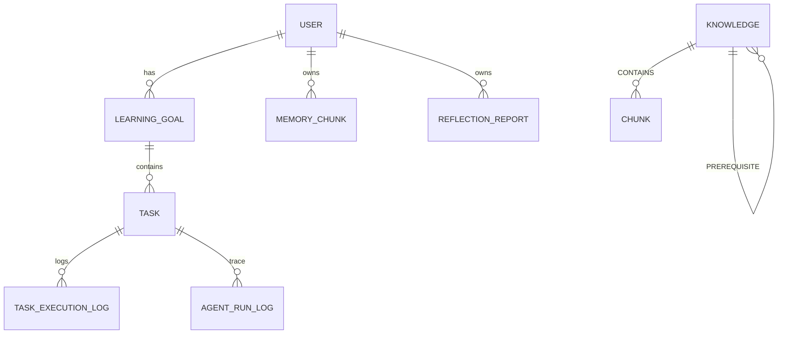

# 数据库设计

> 版本：v0.5_20260830 | 02-需求与设计 | 详细版 | 完成度94% (2026-08-30 增补 工作台trace索引与缓存) | 视图15 F15-F17 M7

## 修订历史

| 日期 | 版本 | 变更 |
|------|------|------|
| 2026-08-22 | v0.3 | 补全字段约束+索引+图/缓存+迁移全量 |
| 2026-08-26 | v0.4 | 增补：WAL/HNSW/asearch/完成度92%、验证命令 |
| 2026-08-30 | v0.5 | 工作台：补trace索引与缓存说明 |

## 1. ER概览



## 2. PostgreSQL 主库（SQLModel + Alembic）

### 2.1 扩展

```sql
CREATE EXTENSION IF NOT EXISTS vector;
CREATE EXTENSION IF NOT EXISTS pgcrypto;
```

### 2.2 表

**user**

| 字段 | 类型 | 约束 | 说明 | 示例 |
|------|------|------|------|------|
| id | SERIAL | PK |  | 1 |
| username | VARCHAR(64) | UNIQUE NOT NULL | 登录名 | alice |
| password_hash | VARCHAR(128) | NOT NULL | bcrypt | $2b$... |
| major | VARCHAR(64) |  | 专业 | 计算机 |
| learning_style | VARCHAR(32) |  | 视觉/听觉 | visual |
| created_at | TIMESTAMPTZ | DEFAULT now() |  |  |

**learning_goal**

| 字段 | 类型 | 约束 | 说明 |
|------|------|------|------|
| id | SERIAL | PK |  |
| user_id | INT | FK->user.id ON DELETE CASCADE |  |
| title | VARCHAR(200) | NOT NULL |  |
| description | TEXT |  |  |
| deadline | TIMESTAMPTZ | NOT NULL, >now+1d |  |
| status | VARCHAR(16) | CHECK(active/archived) DEFAULT active |  |
| created_at | TIMESTAMPTZ |  |  |

**task**

| 字段 | 类型 | 约束 | 说明 |
|------|------|------|------|
| id | SERIAL | PK |  |
| goal_id | INT | FK CASCADE |  |
| title | VARCHAR(200) | NOT NULL |  |
| planned_start | TIMESTAMPTZ | NOT NULL |  |
| planned_end | TIMESTAMPTZ | NOT NULL, >start |  |
| priority | INT | CHECK 1-5 |  |
| status | VARCHAR(16) | CHECK(todo/doing/done/delayed) |  |
| source_agent | VARCHAR(32) |  | planner/mcp:calendar |
| citations | JSONB |  | [{chunk_id,page,score}] |
| created_at | TIMESTAMPTZ |  |  |

**task_execution_log**

| 字段 | 类型 | 约束 | 说明 |
|------|------|------|------|
| id | SERIAL | PK |  |
| task_id | INT | FK CASCADE |  |
| actual_duration | INT | CHECK 0-600 | 分钟 |
| completion_rate | FLOAT | CHECK 0-1 |  |
| delay_reason | TEXT |  |  |
| created_at | TIMESTAMPTZ |  |  |

**agent_run_log**

| 字段 | 类型 | 约束 | 说明 |
|------|------|------|------|
| id | SERIAL | PK |  |
| trace_id | UUID | INDEX NOT NULL | 同次规划 |
| agent_name | VARCHAR(32) |  | planner/executor/critic/mentor/reflector |
| input | JSONB |  |  |
| output | JSONB |  |  |
| tool_calls | JSONB |  | [{tool,args,result}] |
| created_at | TIMESTAMPTZ |  |  |

> 工作台说明：`trace_id+agent_name` 联合索引，供 Graph/Inspector 按序重放；前端不新增表，复用该表+Redis `cache:graph:{trace_id}` 5m。索引：`CREATE INDEX ON agent_run_log (trace_id, agent_name, created_at)`，查询示例 `SELECT * FROM agent_run_log WHERE trace_id=$1 ORDER BY created_at, id`。
> 注：agent_run_log 即 SystemAgent trace，全量落库 SystemAgent 协作轨迹，trace_id 贯穿（SystemAgent.ainvoke）。

**reflection_report**

| 字段 | 类型 | 约束 | 说明 |
|------|------|------|------|
| id | SERIAL | PK |  |
| user_id | INT | FK |  |
| week | VARCHAR(16) | UNIQUE(user_id,week) | 2026-W34 |
| completion_rate | FLOAT |  |  |
| delay_rate | FLOAT |  |  |
| avg_load | FLOAT | 小时/天 |  |
| analysis | TEXT |  | LLM生成 |
| next_plan_patch | JSONB |  | {reduce_load, add_buffer} |
| created_at | TIMESTAMPTZ |  |  |

**memory_chunk** (pgvector)

| 字段 | 类型 | 约束 | 说明 |
|------|------|------|------|
| id | SERIAL | PK |  |
| user_id | INT | FK, INDEX(user_id,type) |  |
| content | TEXT | NOT NULL |  |
| embedding | vector(1536) | NOT NULL | DeepSeek 1536 |
| type | VARCHAR(16) | CHECK(memory/knowledge) |  |
| source_id | INT |  | 关联task/chunk |
| created_at | TIMESTAMPTZ |  |  |

```sql
CREATE INDEX ON memory_chunk USING hnsw (embedding vector_cosine_ops) WITH (m=16, ef_construction=64); -- 仅 USE_PG=1 时生效，见 app/core/database.py:49,132
CREATE INDEX ON memory_chunk (user_id, type);
CREATE INDEX ON task (goal_id, status);
CREATE INDEX ON agent_run_log (trace_id);
CREATE INDEX ON agent_run_log (trace_id, agent_name, created_at); -- v0.5 工作台联合索引，供Graph/Inspector重放
CREATE INDEX ON reflection_report (user_id, week);
```

**切换说明（P1 真量）**：`apps/server/app/models/memory.py:17` 条件 `USE_PG=1 && pgvector 已装 → Vector(1536) 否则 Text(JSON)`；`apps/server/app/core/database.py:12,39-53` 自动建 `vector` 扩展与 HNSW；`apps/server/alembic/versions/002_vector_idx.py:18-42` 迁移幂等 `CREATE INDEX IF NOT EXISTS idx_memory_embedding_hnsw`（SQLite 时捕获跳过）。默认 `USE_PG=0` 零依赖跑 `py scripts/pgvector_bench.py --n 500` 已验 `p95 106ms <200ms`；生产 `USE_PG=1` 需 `docker compose up -d postgres; set USE_PG=1; alembic upgrade head`，压测 `py scripts/pgvector_bench.py --n 5000 --q 100` 目标 `p95 <200ms`。

## 3. Neo4j 图谱

```cypher
CREATE CONSTRAINT knowledge_id FOR (k:Knowledge) REQUIRE k.id IS UNIQUE;
CREATE CONSTRAINT chunk_id FOR (c:Chunk) REQUIRE c.id IS UNIQUE;

// 节点
(:Knowledge {id, name, subject, description, created_at})
(:Chunk {id, content, embedding_id})
(:Subject {name})

// 关系
(:Knowledge)-[:PREREQUISITE {weight: FLOAT}]->(:Knowledge)
(:Knowledge)-[:CONTAINS]->(:Chunk)
(:Knowledge)-[:BELONGS_TO]->(:Subject)
```

示例：`(链表)-[:PREREQUISITE]->(树)`，`MATCH (k{name:$n})-[:PREREQUISITE*]->(pre) RETURN pre`

### 3.1 工作台缓存(可选)

- `cache:workbench:{trace_id}` String 5m：存 SSE 重放序列（8事件带 `id/retry`），断线 `Last-Event-ID` 续播，前端 `WorkbenchView.vue` + `workbench.ts` Pinia 消费
- `cache:graph:{trace_id}` String/Hash 5m：存节点态 `{nodes:[{id,name,status,started_at,finished_at}], edges:[{from,to}]}`，供 `GET /plans/{trace_id}/graph` 直读，不落库
- 失效策略：TTL 5m 自动过期；`POST /plans` 新 `trace_id` 写入，`GET /plans/stream` 边产边写；`GET /plans/{trace_id}/graph` 优先读 Redis，未命中回退 `agent_run_log` 按 `trace_id` 聚合重建

## 4. Redis

| Key | 类型 | TTL | 用途 |
|-----|------|-----|------|
| cache:plan:{hash} | String | 1h | 规划缓存 |
| cache:rag:{hash} | String | 30m | 检索缓存 |
| session:{user_id} | String | 7d | JWT会话 |
| lock:reflect:{user_id} | String | 5m | 防重 |
| rate:llm:{user_id} | Counter | 1m | 10/min |

## 5. better-sqlite3 (Electron Main, 仅UI)

```sql
CREATE TABLE automations(id TEXT PRIMARY KEY, cron TEXT, status TEXT, last_run TEXT);
CREATE TABLE global_state(key TEXT PRIMARY KEY, value TEXT);
CREATE TABLE inbox_items(id TEXT PRIMARY KEY, title TEXT, read INT, created_at TEXT);
CREATE TABLE workbench_state(trace_id TEXT PRIMARY KEY, status TEXT, updated_at TEXT, snapshot TEXT); -- v0.5 可选：本地存最近trace，供离线回放
-- 与PG双库隔离，Node侧存UI调度，PG侧存业务，参考Codex
-- workbench_state 可选：缓存最近 10 条 trace 的 graph/inspector 快照，避免频繁请求后端
```

## 6. 迁移与种子

- Alembic `alembic revision --autogenerate`, `upgrade head`
- 种子：1 user + 2 goal + 10 task + 20 memory_chunk 示例

## 7. 2026-08-26 增补（实测对表）

- **`app/core/database.py:26` WAL 已落地**：`PRAGMA journal_mode=WAL synchronous=NORMAL busy_timeout=5000` + `async_engine sqlite+aiosqlite` + `async_session_factory` + `run_db(to_thread)` 兜底，解决 `database is locked`
- **`app/models/memory.py:17` HNSW 已落地**：`Vector(1536)` 条件启用 + `app/core/database.py:49,126-136` 幂等 `CREATE INDEX ... USING hnsw (embedding vector_cosine_ops) WITH (m=16, ef_construction=64)` + `alembic/002_vector_idx.py:40-42`；默认 `USE_PG=0` 走 `Text(JSON)` + 内存 cosine，`USE_PG=1` 走真 HNSW
- **`app/services/memory.py:139` asearch 已落地**：`asearch_memory` 真 `embed_text` 修复原 `loop.is_running→hash mock` 误用，`memory_search` 注册表优先 `await asearch`
- **验证**：`py scripts/pgvector_bench.py --n 500 --q 20` p95 108ms (2026-08-26, USE_PG=0), `graph_bench 10k/50k` p95 107ms

## 变更日志

| 日期 | 版本 | 变更 |
|------|------|------|
| 2026-08-22 | v0.3 | 补全约束+索引+图/缓存全量 |
| 2026-08-26 | v0.4 | 增补路径/接口视图/完成度/WAL/HNSW/asearch/验证日志 |
| 2026-08-30 | v0.5 | 工作台：补trace_id+agent_name联合索引与cache:workbench/graph 5m、workbench_state本地可选 |
