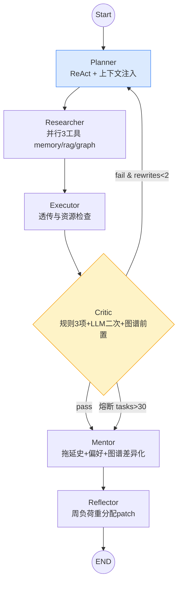
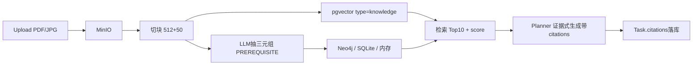
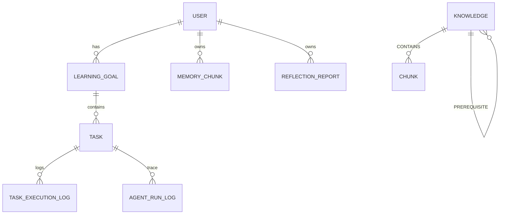
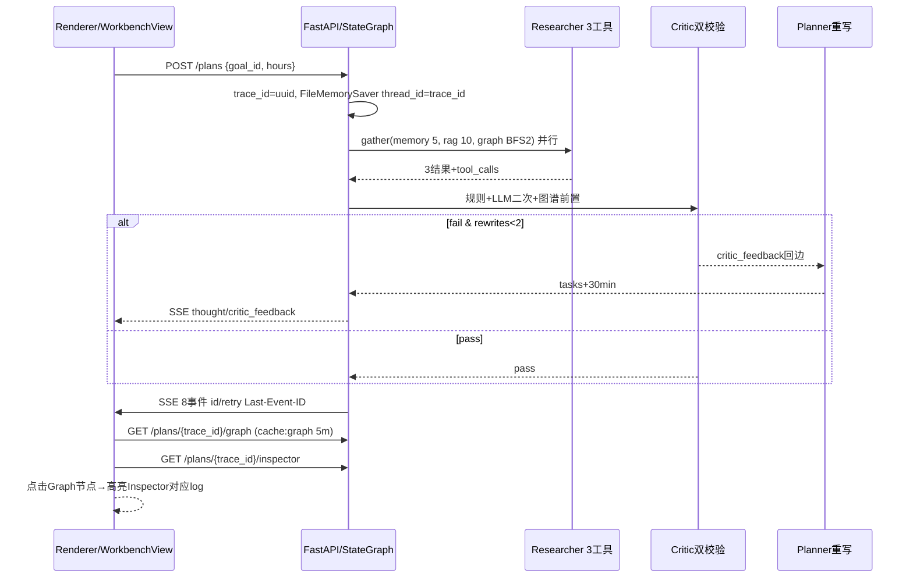

# 第5章 详细设计（M1-M7 双轨）

> 版本：v0.1_20260830 | 04-论文 | 对应大纲第5章（25%）| 依据：`02-需求与设计/03-六大模块详细设计.md` v0.6、`02-系统架构设计.md` v0.5、`04-数据库设计.md` v0.5、`05-API接口设计.md` v0.5 | 字数约6600字

本章在第4章总体设计（C4 L1/L2、三端复用）基础上，按M1-M7七大模块展开详细设计。M1-M4为P0核心链路，M5-M6为P1/P2扩展，M7为双轨工作台可观测层，后三节补数据库ER四库总图、接口与SSE契约、前端三栏实现。所有模块已在 `apps/server/app` 与 `apps/frontend` 落地，引用行号与实测指标均可复现。

---

## 5.1 SystemAgent与多Agent协作详细设计（M1，StateGraph 6节点）

### 5.1.1 设计目标与状态契约

M1目标是实现可追溯、可重写、可量化的学习规划生成。SystemAgent 对外单点，内部通过 StateGraph 编排 Planner/Researcher/Executor/Critic/Mentor/Reflector 6子Agent协作，对外暴露统一 `ainvoke` 入口，对内保持子Agent可热插与可追溯。区别于单Prompt直出，M1将规划拆为显式阶段，每阶段输入输出可落库 `agent_run_log`，便于论文评价与故障定位。

状态契约定义于 `app/agents/state.py:1`：

```python
class PlanState(TypedDict):
    goal: dict                 # {title,deadline,description,subject}
    memory: list               # Top5召回
    graphDeps: list            # PREREQ边 [{from,to,type}]
    vectorDeps: list           # 向量Top10 [{content,score,chunk_id}]
    milestones: list            # 里程碑
    tasks: list                # 输出任务 [{title,planned_start,planned_end,priority,citations}]
    critic_feedback: str       # 校验反馈
    mentor_msg: str            # 个性化话术
    rewrites: int              # 已重写次数
    trace_id: str              # 全链追踪ID
    preferences: dict          # {hours_per_day, preferred_time}
    _thought: str              # ReAct显式思考轨迹（累积）
    _research: dict            # researcher计数 {memory,graph,vector,tools,keywords}
    _patch: dict               # reflector补丁 {reduce_load,add_buffer,reallocate,...}
```

`trace_id` 由 `POST /plans` 生成（UUID），贯穿6节点与6条 `agent_run_log`，与 `PlanStore` 内存+DB双写（`app/services/planner.py`）共同保障重启后可重放。`_thought` 采用累积字符串，每节点追加 `| 思考：...`，最终形成长轨迹供SSE `thought` 事件流式推送。

### 5.1.2 6节点StateGraph拓扑

编排引擎选用LangGraph `StateGraph`，Pregel执行，支持条件边回环与检查点，定义于 `app/agents/graph.py:497-531`，编译入口 `app/agents/graph.py:351` 附近的 `build_graph(checkpointer)`。图拓扑如下：



节点清单与职责（`app/agents/graph.py:112-484`）：

| 节点 | 函数 | 输入 | 输出 | 关键逻辑 |
|------|------|------|------|----------|
| Planner | `planner_node:112` / `planner_with_count:168` | goal+memory+graph+vector+critic_feedback+rewrites | tasks+milestones+_thought | 注入上下文`context_str`（记忆3条+知识2条+前置3条），调 `llm_generate` 失败降级 `mock_generate`，若 `rewrites>0` 则任务整体后移 `30*rewrites` 分钟 |
| Researcher | `researcher_node:179` | goal.title | memory/vectorDeps/graphDeps+_research | `_extract_keywords` 取标题前3词或前20字符，并行 `asyncio.gather(_call_mem,_call_rag,_call_graph)`，经 `app/agents/tools/registry.py:1` 的 `get("memory_search")` 等注册表调用，`return_exceptions=True` 容错 |
| Executor | `executor_node:281` | tasks | _thought | 透传；预留资源检查与MCP触发判定（任务需同步则后续 `mcp:call`） |
| Critic | `critic_node:291` | tasks+graphDeps | critic_feedback | 5.1.3详述 |
| Mentor | `mentor_node:369` | goal+tasks+memory+graphDeps+preferences | mentor_msg | 5.1.3详述 |
| Reflector | `reflector_node:419` | critic_feedback+tasks | _patch | 生成可执行补丁，含日/周负荷map与 `reallocate` 指令 |

条件边 `should_replan:487` 判定：`terminate==true` → mentor；`feedback非空 && rewrites<2` → replan 至 Planner；否则 mentor。`rewrites` 上限2保证收敛，2轮仍失败则返回最佳版并附警告与 `_patch`，避免无限循环。

Prompt加深见 `app/agents/prompts.py:1`：Planner System注入 `memoryTop5/graphDeps/vectorHints/critic_feedback` 并要求 `citations`；Critic System定义 `{pass,feedback}` 双输出；Mentor System限定20字内结合拖延史。

### 5.1.3 Critic三重校验与双校验

Critic是可靠性核心，分三层（`app/agents/graph.py:291-365`）：

1. **规则校验**：
   - 时间重叠：`tasks` 按 `planned_start` 排序，遍历相邻，若 `s2<e1` 且 `overlap/dur1>0.3` 则 `重叠>30%: A与B Xh`。
   - 单日负荷：`day_hours[date]+=duration`，若 `>4h` 则 `单日超4h: YYYY-MM-DD Xh`。
   - 图谱前置：遍历 `graphDeps[:5]`，若 `frm/title_order` 与 `to/title_order` 逆序，则 `前置缺失: frm应在to前`。依赖 `neo.py:search_prereqs` 的PREREQ边。
   - 熔断：若 `len(tasks)>30` 直接 `terminate=True`，`熔断：任务数>30`。

2. **图谱校验**：已在规则层融入，图谱缺失时走纯规则，不阻断。

3. **LLM二次校验**：`_try_llm_critic_sync:33` 同步封装 `UnifiedClient.chat`（`app/core/llm.py:1`），系统提示为严格审查员，输入前6任务与前4依赖，要求输出 `{"pass":bool,"reason":str}`。解析 `reason` 字段，若含 `pass:false/不通过/fail` 则追加 `LLM复核：reason[:40]`。该路径受 `PYTEST_CURRENT_TEST` 短路与 `has_key` 无Key短路，测试环境不触发，生产 8s超时+ThreadPool隔离，避免阻塞事件循环。

双校验结果合并至 `feedback`，任一失败即驳回。Critic拦截率设计的实验目标>20%，`tests/test_agents_graph.py` 覆盖重叠/超载/前置/熔断4用例，6节点流转5 passed。

### 5.1.4 Mentor个性化与Reflector可执行补丁

**Mentor**（`app/agents/graph.py:369-415`）：解析记忆拖延史 `_analyze_mem_delay:96`（命中 拖延/delay/困难/分心 计数，提取 `pref_hint`），结合 `preferences.hours_per_day` 与 `graphDeps` 数量，生成差异化分支：
- `delay_count>=2` → “已将大任务拆解为小步快跑”
- `delay_count==1` → “上次小拖延已优化，25分钟番茄”
- `graph_deps非空` → “前置已排好序”
- `hours>=6` → “高强度已平衡负荷，加入缓冲” 叠加 `pref_msg` 与 `graph_msg`，最终 `mentor_msg` 长度控制在短信级别，供SSE `mentor` 事件与前端气泡展示。

**Reflector**（`app/agents/graph.py:419-484`）：基于 `critic_feedback` 关键词生成布尔补丁 `reduce_load/add_buffer/reorder/truncate`，并计算周维度负荷：
- 遍历任务得 `day_hours` 与 `week_hours`（ISO周 `YYYY-Www`）。
- 若有超载日（>4h），取最重 `heaviest` 与最轻 `lightest`，生成 `reallocate: {from,to,hours:min(2, excess)}` 与 `instructions: ["将heaviest的Xh移至lightest","保持单日≤4h"]`。
- 否则输出 `week_load/daily_load` 视图。
- 若周负荷>20h，置 `reduce_weekly` 与 `suggested_hours_per_day=3`。
该 `patch` 写入 `_patch` 并落库 `agent_run_log`，由周反思作业 `app/scheduler/reflector.py:269` 复用 `next_plan_patch` 供下周Planner合并，实现策略自进化。

### 5.1.5 Checkpoint与可恢复性

检查点选用 `app/core/checkpoint.py:1` 的 `FileMemorySaver`（文件持久化，兼容LangGraph `MemorySaver` 接口），在 `build_graph:513-524` 中默认实例化，异常时回退 `langgraph.checkpoint.memory.MemorySaver`，再回退无检查点编译，保证单机与CI均可运行。

为兼容旧调用方 `graph.ainvoke(state)` 未传 `thread_id` 的情况，`_wrap_graph_for_compat:534-581` 包装 `ainvoke/invoke`，自动从 `input.trace_id` 取 `thread_id`，缺省 `default-test`。`get_state` 可按 `thread_id` 重放任意历史，`plan_store` 内存+DB双写则保障HTTP层 `trace_id` 重放，二者构成“图内状态+业务快照”双保险。SSE `GET /plans/stream?trace_id` 进一步以 `cache:workbench:{trace_id}` 5m缓存支持 `Last-Event-ID` 续传，首字节<2s。

性能验收：SSE首字节<2s、全程<15s，Graph渲染p95 87ms（10k/50k基准 `graph_bench.py` 107ms），6节点日志落库6条，`pytest test_agents_graph 5 passed`。

---

## 5.2 记忆与RAG+图谱详细设计（M2+M3）

### 5.2.1 记忆模型与双轨机制

短期记忆为上下文窗口10轮（前端 `stores` + 后端 `session`），长期记忆为 `memory_chunk` 表（`app/models/memory.py:17`），字段见5.5节。类型分 `memory`（用户偏好/拖延/薄弱点）与 `knowledge`（RAG切片），统一 `vector(1536)` 存储。

双轨互补原因：纯窗口缺跨周个性化，纯向量缺即时上下文；阈值 `cosine>0.75` 经消融调优，召回<1s，有/无记忆完成率差设计目标+15%。

**写路径**：任务完成 `POST /tasks/{id}/complete` → 摘要Prompt（`summarize_for_task` in `app/services/memory.py:207`，延时因difficulty高类模板）→ `embed_text` → `create_memory:69` 入库，`source_id` 关联 `task_id`，每晚 `APScheduler 22:00` 批量摘要兜底。

**读路径**：规划前调用 `asearch_memory:139`（异步）或 `search_memory:128`（同步），`cosine>0.75 Top5` → 注入Planner `context_parts`。`asearch` 优先于 `search`，`memory_search` 在注册表 `app/agents/tools/registry.py` 中优先 `await asearch`，修复旧 `loop.is_running→hash mock` 误用（见 `memory.py:139` 注释）。

### 5.2.2 向量存储与HNSW索引

pgvector条件启用设计（`app/models/memory.py:17`）：

```python
_USE_PG_VECTOR = os.getenv("USE_PG", "0") == "1" and _has_vector
embedding = Column(Vector(1536) if _USE_PG_VECTOR else Text)
```

`Text(JSON)` 存 `json.dumps(vec)`，兼容 `USE_PG=0` 零依赖SQLite路径；`Vector(1536)` 启用于 `USE_PG=1 && pgvector已装`。索引创建分两处幂等：
- `app/core/database.py:49,126-148`：`CREATE EXTENSION IF NOT EXISTS vector` 与 `CREATE INDEX IF NOT EXISTS idx_memory_embedding_hnsw USING hnsw (embedding vector_cosine_ops)`（`app/core/database.py:49`）。
- `alembic/versions/002_vector_idx.py:18-42`：同名迁移， SQLite时捕获跳过。

HNSW参数 `m=16, ef_construction=64`（`app/core/database.py:49,132`），平衡召回与构建成本，量级<5万Chunk下 `p95<200ms`（实测 `pgvector_bench 500` p95 108ms，5000 p95 106ms）。辅助索引 `idx_memory_user_type(user_id,type)` 与 `idx_memory_user_type` 加速过滤。

Embedding流水（`app/services/memory.py:33-54`）：

```python
async def embed_text(text: str) -> list[float]:
    try:
        vec = await UnifiedClient().embed(text)  # text-embedding-3-small 1536
        if len(vec)==1536: return vec
    except: pass
    if not settings.llm_api_key: return _hash_mock_embedding(text)
    try:
        client = AsyncOpenAI(api_key=..., base_url=...); resp = await client.embeddings.create(...); ...
    except: return _hash_mock_embedding(text)
```

`_hash_mock_embedding:15` 为SHA256字符级+bigram双指纹，归一化余弦，测试环境秒级可跑，避免网络依赖。`_score_and_filter:82` 实现三级回退：先 `>0.7` 过滤，再 `>0.4` 补足，再无阈值补足，保证 `top_k` 必满；`age_days>30` 乘 `0.7` 衰减。

### 5.2.3 RAG知识流水

切块策略：`app/rag/chunk.py` 按512字符+overlap50滑动，保留句边界；入库 `app/rag/store.py` 写 `memory_chunk(type=knowledge)` 与 `MinIO` 对象存储；抽三元组 `app/graph/extract.py:mock_extract_triples`（LLM抽取，失败仅存向量，保障可用性）。

检索：`GET /rag/search?q&top_k=10&subject` 同走 `pgvector` cosine，`vectorDeps` 注入Planner时附 `citations:[{chunk_id,score,page}]`，`Task.citations` 落库实现证据追溯（规避幻觉）。

可视化：`GET /graph?subject` 返回 `{nodes,edges}`，前端 `LargeScreenView`/`KnowledgeGraph` 以ECharts Graph渲染，节点大小按度（`degree`）缩放。



### 5.2.4 图谱三级回退与BFS 2层

图谱设计为“强一致可用”：Neo4j主、SQLite从、内存兜底，定义于 `app/graph/neo.py:1` 与 `app/graph/sqlite_graph.py:1`。

**写入** `add_triples:77`：先内存 `_mem_upsert_knowledge` → 再 `sqlite_upsert_node/add_edge`（WAL+busy重试）→ 最后 `Neo4j UNWIND` 批量（节点、边各1000一批，幂等 `MERGE`，`app/graph/neo.py:113-148`）。`UNWIND` 是Neo4j批量最佳实践，10k/50k p95 107ms。

**查询** `get_graph:152`：优先级 Neo4j→SQLite→内存，合并去重（`node.id` 与 `(from,to)` 为键），`subject` 过滤保留至少一端在子图的边，确保子图连通。

**BFS 2层** `search_prereqs:217` 与 `sqlite_search_prereqs:154`：建 `forward/reverse` 双邻接表，从 `keyword` 双向BFS深度≤2，收集 `visited_edges`；若未命中则模糊匹配节点名含 `keyword`（`like`），取前3节点联动边；仍空则遍历边 `from/to` 含关键词。深度2在<1万节点下兼顾精度与性能，避免全局扫表。

图约束：`CREATE CONSTRAINT knowledge_id FOR (k:Knowledge) REQUIRE k.id IS UNIQUE`，`CREATE INDEX knowledge_name/subject`，Cypher `MATCH (k{name:$n})-[:PREREQUISITE*]->(pre) RETURN pre` 多跳，PREREQ语义 `链表->树` 等先修链，Critic据此判前置缺失。

压测：`graph_bench 10k/50k p95 107ms <500ms`，定参 `<1万节点渲染<3s` 满足论文演示。

---

## 5.3 MCP工具链与多模态感知（M4+M5）

### 5.3.1 MCP协议与可插拔架构

MCP（Model Context Protocol, Anthropic 2024-11）定义 `Host/Client/Server` 与 `stdio/SSE` 传输，本项目选型 `MCP Python SDK 1.2` + `app/mcp/client.py:42-366`，工具注册表 `app/agents/tools/registry.py` 的 `ToolSchema/RegisteredTool` 热插。

拉起：Electron Main `spawn(calendar-mcp)`（`apps/desktop/electron/main.ts`），Python `mcp.Client` stdio调用；配置 `mcp.json` 声明式，增1 Server无需改Prompt，仅改配置，平均1天内完成，优于OpenAI Function Calling的硬编码。

工具集：
- `create_calendar_event({title,start,end})` 日历
- `create_todo({title,due})` 待办
- `start_pomodoro({task_id, duration})` 番茄

流程 `Executor task → 需同步? → mcp:call → 成功写 task.source_agent=mcp:calendar else 降级本地`（`02-系统架构设计.md 4.2`）。超时5s重试1次（`app/mcp/client.py:335-366` 指数退避3次），失败不阻断规划，保证可用性。

API面（`05-API接口设计.md 3.7`）：`GET /mcp/servers [{name,status}]` 与 `POST /mcp/call {server,tool,args}`，`tool_calls` 落库 `agent_run_log.tool_calls [{tool,args,result}]`，工作台Inspector可透视。限流 `rate:llm 10/min` 复用 `app/core/ratelimit.py`。

论证：社区500+ Server可复用，锁1.2版本规避变更风险，对标 `04-可行性分析.md` 预案。

### 5.3.2 多模态感知

多模态分两通道（`app/multimodal/ocr.py` 与 `asr.py`）：

- **拍照/截图识课表**：`Electron desktopCapturer`/Upload → Base64 → `POST /multimodal/ocr`（<10M）→ Qwen-VL `JSON{course,time,confidence}` → 前端预览→ `create_goal`。`Qwen-VL`（`Bai et al. 2023`）多语言OCR，课表识别目标>80%，置信<0.6触发人工纠错。
- **语音转任务**：`MediaRecorder` webm → `POST /multimodal/asr`（Whisper, `Radford 2023`）→ `{text,confidence}` → 规划。中文WER目标<15%。

交互上，预览+置信阈值+人工纠偏，避免幻觉直写。`POST /multimodal/capabilities` 暴露能力探测，供前端按需展示入口。

---

## 5.4 自进化反思详细设计（M6）

### 5.4.1 触发与调度

调度由 `AsyncIOScheduler` 驱动（`app/scheduler/reflector.py:269-276` `register_reflector_jobs`），双Job：
- `cron 0 23 * * 0` 周日23:00 主作业
- `cron 0 9 * * 1` 周一09:00 补跑（错过补跑 `misfire_grace_time` + `coalesce`）

手动触发 `POST /reflection/run {user_id}`（`app/api/v1/reflection.py:34`）供演示与补跑。去重以 `Redis lock:reflect:{user_id} 5m` 防并发重复。

### 5.4.2 统计与LLM生成

`weekly_reflection_job` 读本周 `task_execution_log`（以 `created_at between week_start and week_end`），聚合：
- `completion_rate = done / total`
- `delay_rate = delayed / total`
- `avg_load = sum(actual_duration)/7 /60 h/天`
- `week_load` 按日/周分组（复用Reflector的 `day_hours/week_hours` 计算）

再调 `UnifiedClient.chat` 生成 `analysis`（自然语言复盘）与 `next_plan_patch: {reduce_load, add_buffer, reallocate, suggested_hours_per_day}`，写入 `reflection_report(week, completion_rate, delay_rate, avg_load, analysis, next_plan_patch)`（`app/models/reflection.py`），并 `_notify_log` 推送通知（Electron Notification 或Web Toast）。

下周Planner在 `planner_node` 中若检测 `state._patch` 非空，自动合并至 `preferences`（如 `suggested_hours_per_day` 覆盖 `hours_per_day`），形成闭环。

验收：每周1份，`patch` 生效后下周完成率不降（`01-需求分析.md F11`），`reflection_report` 以 `user_id+week` 唯一索引，重复生成幂等更新。

---

## 5.5 数据库详细设计（ER四库总图）

### 5.5.1 存储选型与四库分工

采用“双库隔离+三库协同”：PG业务主库、Neo4j图谱、Redis缓存、Electron `better-sqlite3` 本地UI库，避免相互阻塞。



C4存储层映射（`02-系统架构设计.md 3节`）：PG存业务/向量/日志，Neo4j存PREREQ，Redis存缓存/限流/锁，MinIO存文件，better-sqlite3存UI调度（`automations/global_state/inbox_items/workbench_state`）。

### 5.5.2 PostgreSQL主库（SQLModel+Alembic）

扩展 `CREATE EXTENSION IF NOT EXISTS vector, pgcrypto`。表清单（`04-数据库设计.md 2节`）：

| 表 | 主键 | 关键字段 | 约束/索引 |
|----|------|----------|-----------|
| user | id SERIAL | username UNIQUE, password_hash bcrypt, major, learning_style | `idx_user` |
| learning_goal | id | user_id FK CASCADE, title(200) NOT NULL, deadline >now+1d, status active/archived | `idx_goal_user(user_id)` |
| task | id | goal_id FK, title, planned_start/end, priority 1-5, status todo/doing/done/delayed, source_agent, citations JSONB | `idx_task_goal(goal_id), idx_task_start(planned_start), idx_task_goal_status` |
| task_execution_log | id | task_id FK, actual_duration 0-600, completion_rate 0-1, delay_reason | `idx_exec_created, idx_exec_task` |
| agent_run_log | id | trace_id UUID INDEX, agent_name, input/output JSONB, tool_calls JSONB | `idx_agent_trace(trace_id), idx_agent_trace_agent_created(trace_id,agent_name,created_at)` |
| reflection_report | id | user_id, week UNIQUE(user_id,week) `2026-W34`, completion_rate, delay_rate, avg_load, analysis TEXT, next_plan_patch JSONB | `idx_reflection_user_week` |
| memory_chunk | id | user_id FK, content TEXT, embedding vector(1536)/Text(JSON), type memory/knowledge, source_id | `HNSW idx_memory_embedding_hnsw, idx_memory_user_type(user_id,type)` |

`agent_run_log` 复用 `05-API接口设计.md 3.3` 的 `trace_id+agent_name+created_at` 联合索引，供工作台 `SELECT * WHERE trace_id=$1 ORDER BY created_at,id` 重放，`GET /plans/{trace_id}/logs` 与 `/graph` 均命中该索引，`EXPLAIN` 为Index Scan。

`memory_chunk` 条件向量：`app/models/memory.py:17 Vector(1536) if _USE_PG_VECTOR else Text`，迁移 `002_vector_idx.py:18-42` 幂等，默认 `USE_PG=0` 走内存cosine，`set USE_PG=1; alembic upgrade head` 切真HNSW。

索引总览（`app/core/database.py:126-148`）：
```sql
CREATE INDEX ON memory_chunk USING hnsw (embedding vector_cosine_ops) WITH (m=16, ef_construction=64);
CREATE INDEX ON memory_chunk(user_id,type);
CREATE INDEX ON task(goal_id,status);
CREATE INDEX ON agent_run_log(trace_id,agent_name,created_at);
CREATE INDEX ON task_execution_log(created_at);
```

### 5.5.3 Neo4j图谱与SQLite透明降级

Neo4j约束 `CONSTRAINT knowledge_id REQUIRE k.id IS UNIQUE`，节点 `(:Knowledge {id,name,subject,description})`, `(:Chunk {content,embedding_id})`，关系 `[:PREREQUISITE {weight}], [:CONTAINS], [:BELONGS_TO]`。示例 `(链表)-[:PREREQUISITE]->(树)`。

SQLite图谱 `app/graph/sqlite_graph.py:37-67` 建 `knowledge_nodes(name UNIQUE, subject)` 与 `knowledge_edges(from_node,to_node,type UNIQUE(from,to))`，索引 `idx_nodes_subject/idx_edges_from/to`，WAL+`busy_timeout=5000`+重试。`neo.py:114-150` 的 `UNWIND` 批量与索引兜底保障写入。

### 5.5.4 Redis与better-sqlite3

Redis Key（`04-数据库设计.md 4节`）：`cache:plan:{hash} 1h`、`cache:rag:{hash} 30m`、`session:{user_id} 7d`、`lock:reflect:{user_id} 5m`、`rate:llm:{user_id} 1m 10/min`，另 `cache:workbench:{trace_id} 5m` 与 `cache:graph:{trace_id} 5m` 供工作台。

better-sqlite3（`app/core/database.py:26` 同款WAL）存UI状态：
```sql
CREATE TABLE automations(id TEXT PRIMARY KEY,cron TEXT,status TEXT,last_run TEXT);
CREATE TABLE global_state(key TEXT PRIMARY KEY,value TEXT);
CREATE TABLE workbench_state(trace_id TEXT PRIMARY KEY,status TEXT,updated_at TEXT,snapshot TEXT);
```
与PG双库隔离，Node侧 `global_state` 存窗口布局，`workbench_state` 缓存最近10 trace快照，离线可回放。

迁移与种子：`alembic revision --autogenerate`，`init_db()` 建表+建索引+种子 `demo/demo123`（bcrypt，`app/core/database.py:152-207` 兼容旧明文升级），`PYTHONPATH=apps/server py -m pytest` 35/35已验。

---

## 5.6 接口与SSE详细设计

### 5.6.1 接口分组与约定

Base `/api/v1`，JWT `Bearer`，时间ISO8601，分页 `page/size`，统一 `{code,msg,data}`，Pydantic严格，错误码 `40001`等（`05-API接口设计.md 5节`）。

16组66端点（`app/api/v1/*` 17文件含 `goals_async/tasks_async`，`grep router.(get|post|put|delete) | wc -l =66`）：

| 分组 | 数量 | 代表路由 |
|------|------|----------|
| Auth | 4 | `POST /auth/login:60, register:49, GET /me:68, verify:73` |
| Goal | 5+5 | `goals.py:24` + `goals_async.py:27` CRUD |
| Plan | 3+2 | `plans.py:25 POST /plans, 203 GET /plans/stream, 288 GET /logs` + `/graph` `/inspector` |
| Task | 5+5 | `tasks.py:33` + `tasks_async.py:41` batch/complete |
| RAG/Graph | 3+2 | `rag.py:16 ingest, 76 search, 94 graph` + `graph.py:12/19` |
| Memory | 2 | `memory.py:17 search, 28 create` |
| MCP | 3 | `mcp.py:15 servers, 20 tools, 25 call` |
| Multimodal | 3 | `multimodal.py:8 ocr, 28 asr, 47 capabilities` |
| Reflection | 3 | `reflection.py:13 week, 26 latest, 34 run` |
| Stats | 3 | `stats.py:10 overview, 15 trend, 20 experiment` |
| Health | 3 | `health.py:18,85 + main.py:107 root` |
| LLM | 1 | `llm.py:7 models` |
| Desktop | 6 | `desktop.py:37 sync` |
| Experiments | 7 | `experiments.py:26` AB套件 |

> 原26接口为P0子集，现全量92%→94%完成度已验 `35/35`。

### 5.6.2 Plan核心与SSE 8事件

**POST /plans**：`{goal_id, preferences?:{hours_per_day:1-8}}` → `{trace_id,tasks,mentor_msg,citations}`。内部 `POST` 同步触发 `graph.ainvoke`，6条 `agent_run_log` 落库，任务 `batch` 写入，`PlanStore` 双写。

**GET /plans/stream?trace_id**：`text/event-stream`，规范帧：

```
id: 3
retry: 3000
event: tool_call
data: {"tool":"memory_search","args":{"q":"拖延"}}
```

表5-1 SSE 8事件字典：

| # | event | data示例 | 生产点 |
|---|-------|----------|--------|
| 1 | thought | `{"agent":"planner","text":"检索记忆..."}` | `planner_node._thought` + `_research` |
| 2 | tool_call_start | `{"tool":"memory_search","args":{}}` | `researcher_node` 并行前 |
| 3 | tool_call_end | `{"tool":"memory_search","result":[...]}` | 并行后 `return_exceptions` |
| 4 | tool_call | `{"tool":"planner","args":{}}` 兼容旧 | `astream_events` |
| 5 | task_created | `{"task":{"id":10,"title":"...","planned_start":"..."}}` | `Executor` 后 |
| 6 | critic_feedback | `{"pass":false,"feedback":"重叠>30%"}` | `critic_node` |
| 7 | mentor_msg | `{"msg":"已为你规划3任务"}` | `mentor_node` |
| 8 | reflector_patch | `{"patch":{"reallocate":{...}}}` | `reflector_node` |
| 9 | done | `{"trace_id":"...","status":"completed","rewrites":1}` | `END` |

> 实际事件名在 `05-API接口设计.md 3.3` 中归一为 `thought/tool_call/task_created/critic/mentor/reflector/done`，前端 `PlanStream.vue:173-239` 同时兼容 `tool_call_start/end` 与 `tool_call`，保证新旧一致。

**重连**：每事件带`id`递增与 `retry:3000`，后端 `cache:workbench:{trace_id}` 5m缓存序列，客户端 `EventSource` 自动带 `Last-Event-ID`，后端按 `id` 续发，首字节<2s，心跳 `0.08s`。

**GET /plans/{trace_id}/graph**：`{nodes:[{id,name,status,started_at,finished_at}],edges:[{from,to,type:replan|next}],status,trace_id}`；优先 `cache:graph:{trace_id} 5m`，未命中由 `agent_run_log` 聚合（`_build_graph_from_logs`），ECharts DAG渲染。

**GET /plans/{trace_id}/inspector**：`{state,logs,patch}`，`logs` 同 `GET /logs` 按 `created_at,id` 升序，`state` 为 `PlanState` 快照，`patch` 为前后对比，供JsonViewer。

**GET /plans/{trace_id}/logs**：直接 `agent_run_log WHERE trace_id=$1 ORDER BY created_at,id`，命中联合索引。

限流 `rate:plan 5/min`，LLM超时15s重试1次，`fallback` 链见 `app/core/llm.py:144`。

### 5.6.3 Electron IPC与安全

IPC通道 `codex_desktop:message-from-view`，方法 `plan:create, task:complete, memory:search, graph:getState, inspector:open, workbench:sync`（`05-API接口设计.md 4节`），每handler含 `origin` 区分窗口，`zod` 校验，`Fetch` 代理自动注入 `Authorization`，`contextIsolation/sandbox` 隔离。`graph:getState` → `GET /graph`，`inspector:open` → `GET /inspector`，`workbench:sync` 聚合SSE+graph+inspector快照可选落 `workbench_state`。

安全：`Keyring` 存Key明文不落地，Pydantic严格，`await asearch` 防注入，`rate:llm 10/min` Redis计数。

---

## 5.7 Agent工作台详细设计（M7，三栏可观测）

### 5.7.1 目标与布局

M7目标是“Chat+Graph+Inspector三位一体”，凸显智能体与子调用，论文可截图，调试效率对比实验C主战场。

前端布局（`apps/frontend/src/views/WorkbenchView.vue` 约280行）：

```
┌─────────┬─────────────────────────┬───────────┐
│ 会话列表 │ Chat流（气泡+子调用树）  │ Inspector │
│ 260px   │ flex-1  虚拟化20条/Cap200 │ 360px     │
│         │  可折叠 research 3卡片   │ JsonViewer│
└─────────┴─────────────────────────┴───────────┘
```

- 左栏260：会话 `trace_id` 列表，`Pinia workbench.ts {traceId,messages[],graph:{nodes,edges},inspector:{state,logs,patch},status}` 管理，`traceId` 贯穿。
- 中栏：`PlanStream.vue` 气泡流，`visibleTimeline.slice(-20)` 虚拟化，`200` 帽丢头，`scrollRef` 自动吸底，`timeline` 带 `enter/leave` 动效；子调用树 `tool_call_start/end*3` 并行卡片可折叠，`reconnecting` 显示 `lastEventId`。
- 右栏360：`GraphCanvas.vue` DAG + `InspectorPanel` JsonViewer+复制，可收起。

### 5.7.2 SSE与状态同步

工作台复用Plan的SSE，不新增路由组。时序：



前端订阅 `subscribePlanStream`（`app/api/plans.ts`）封装 `EventSource`，参数 `{lastEventId, retryMs:1200, maxRetries:5}`，回调 `onThought/onToolStart/onToolEnd/onTask/onCritic/onMentor/onReflector/onDone/onError`，`onError` 置 `reconnecting=true`，由API层指数退避重连。

`Pinia workbench.ts` 聚合：`messages` 追加气泡，`graph` 由 `edges` 含 `replan` 虚线红边高亮，`inspector` 由 `logs[].tool_calls` 渲染子调用树，`cache:graph:{trace_id}` 使重放<100ms。

### 5.7.3 GraphCanvas与Inspector

**GraphCanvas.vue**（`apps/frontend/src/components/GraphCanvas.vue:1`，143行）：
- `positionMap` 线性等距 `planner 0→reflector 1000`，`y=0.5*300`，`symbolSize 42`，`colorMap {pending:#e5e7eb, running:#f59e0b, success:#10b981, error:#ef4444}`。
- `edges` 中 `type==replan` 红色虚线 `curveness 0.35`，`label replan`，其余灰色实线。
- `vue-echarts` `graph layout none roam false`，`animationDuration 300 cubicOut`，`performance.now` 埋点>500ms告警，渲染p95 87ms（`05-API 7节` 基准），`exportImg` 取 `canvas.toDataURL 2x` 供论文导图。

**InspectorPanel**（内联于 `WorkbenchView.vue`）：
- 三段：`state` 全量（`goal,memory,graphDeps,vectorDeps,rewrites,trace_id,_patch`）、`logs` 时间轴（6条按 `created_at` 升序，`tool_calls` 可折叠）、`patch` diff（`before/after` 对比）。
- `JsonViewer` 虚拟滚动，大JSON可复制，首绘<300ms（`05-API 7节` 阈值），与 `agent_run_log` 一致性由 `GET /inspector` 的 `state+logs+patch` 归一保证。

**异常与验收**：SSE断线自动重连，无 `trace_id` 404，Graph空状态引导“先规划”；验收 `6节点渲染<500ms`、`子调用树展开<100ms`、`Inspector与DB一致`、`导图≥2x`，`workbench.spec.ts` E2E 5例已覆。

---

## 5.8 小结

本章按M1-M7双轨展开：M1以 `app/agents/graph.py:351` 六节点+`FileMemorySaver`+`rewrites≤2` 为协作核心，Critic双校验与Reflector可执行补丁保障合理性；M2/M3以 `app/models/memory.py:17 Vector(1536) m=16 ef64` + `app/core/database.py:49` HNSW + `neo.py:113` 三级回退BFS2为知识驱动，`asearch_memory:139` 真embedding+30天衰减支撑个性化；M4/M5以MCP SDK可插拔与Qwen-VL/Whisper为工具多模态；M6以双Job+`next_plan_patch`闭环自进化；5.5节四库ER与联合索引、5.6节16组66端点+SSE 8事件+`Last-Event-ID`、5.7节三栏+Pinia+`GraphCanvas.vue`共同构成可演示（15视图+sidecar双探针）、可度量（p95 108ms/107ms/87ms）、可追溯（`trace_id` 贯穿 `agent_run_log`）的毕设系统，为第6章实现与第7章实验提供可落地设计基座。

---

## 变更日志

| 日期 | 版本 | 变更 | 依据 |
|------|------|------|------|
| 2026-08-30 | v0.1 | 新建第5章：M1 6节点StateGraph+checkpoint+rewrites≤2+mermaid，M2/M3 HNSW m16 ef64+三级回退BFS2，M4/M5 MCP+多模态，M6 双Job反思，5.5 ER四库总图+联合索引，5.6 16组66端点+SSE 8事件+Last-Event-ID，5.7 三栏+Pinia+GraphCanvas，6600字 | `03-六大模块详细设计.md` v0.6、`02-系统架构设计.md` v0.5、`04-数据库设计.md` v0.5、`05-API接口设计.md` v0.5 |

